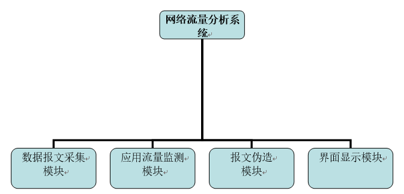
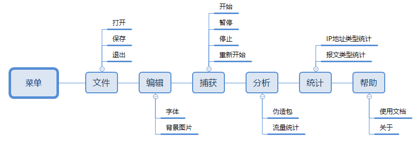
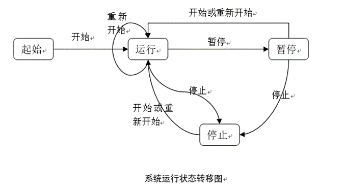
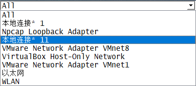
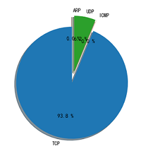
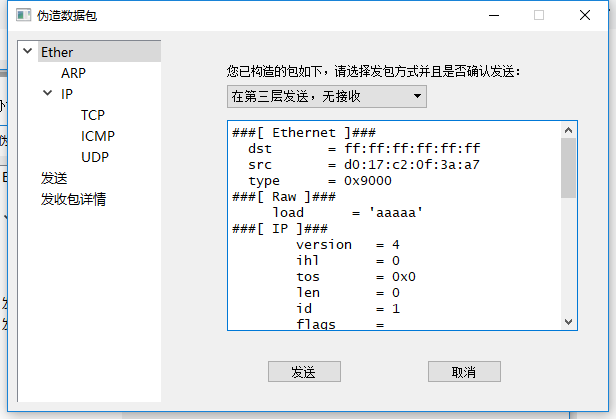

# WireWhale
## 简介
#### 基于Python3.6，Scapy2.4，可以侦听、解析、构造并发送数据包的多功能抓包软件。其中还包括的扩展功能有：流量监测及攻击检测（Land攻击，Ping of Death）。软件目前支持解析的协议有：IP, IPv6, ARP, TCP, UDP, ICMP, SSDP, ICMPv6主要协议及扩展头, TLS。

## 主要功能
1. 对网络接口的数据包尽可能多的捕获，可以将网卡设置为混杂模式，然后进行数据包的采集；
2. 对捕获的数据包进行一定的解析，将报文在网络层和传输层逐字段展开，对数据包的协议类型、源目的地址、数据包截获时间、数据包内容进行分析；
3. 根据用户不同的要求能够依据特定指定地址、特定协议类型相关包等条件进行自定义监视；
4. 针对应用进行流量监测，监测结果输出实时流量图显示，管理员可设置流量预警线，当应用流量超过预警线时自动报警；
5. 系统提供了多种方式显示结果，如以饼状图的形式统计ARP报文、TCP报文、UDP报文ICMP报文进行统计，以柱状图的形式统计IPv4报文、IPv6报文进行统计，以折线图的形式实时显示具体应用流量；
6. 实现数据包保存，便于日后分析，即将捕获到的数据包，可另存为一个文件，并能被本系统所读取和展示；
7. 伪造报文实现网络反攻击或进行深入微调IP或传输层的域。

## 主要模块

* 数据报文采集模块：完成网络接口数据的捕获、解析，可以根据用户定义条件组合来进行捕获，如只监视采用TCP或UDP协议的数据包，也可以监视用户希望关注的相关IP地址的数据包，同时完成数据封包日志记录，提高了系统的灵活性。此外，对IP类型、ARP、TCP、UDP、ICMP的数量进行统计。
* 应用流量监测模块：获取当前正在运行的应用进程，用户可选择一个应用进行流量监测，获取应用中流量信息，同时对一些常见的入侵攻击特征进行判断，如根据源目的地址是否相同判断Land攻击、IP头部长度是否过长判断ping拒绝服务攻击，并发出预警。
* 报文伪造模块：可以自行构造Ether、IP、TCP、UDP、ICMP、ARP报文，并选择send()、sendp()、sr()、srl()、srloop()五种方式发送报文以实现简单攻击或对TCP/IP进行调试。
* 界面显示模块：设计系统主窗口即数据报文采集界面、应用流量监测界面、报文伪造界面。并完成报文统计图的显示，流量图的显示。

## 源代码结构

>	+ **img**
存放程序中使用的图标。
>	+ **capture_core.py**
抓包程序的后台文件，主要用来生成数据包的摘要信息、分析数据包的结构、程序状态处理、下载速度和上传速度的更新等。
>	+ **flow_monitor.py**
流量监控程序的后台服务代码，实时更新速度、应用流量的过滤及摘要信息的生成、更新应用的网络连接等。
>	+ **forged_packet**
用于构造数据包并发送，可自定义数据包的每个字段，实现网络攻击或网络欺骗等功能。
>	+ **main_ui.py**
抓包程序的GUI代码，包括了快捷键的绑定以及可自定义字体和背景图片、已抓到数据包的摘要信息的展示、显示某个数据包的详细信息和十六进制数据等功能。
>	+ **main.py**
程序的入口。
>	+ **monitor_system.py**
流量监控的GUI代码，用于查看网络连接速度等。
>	+ **tools.py**
工具代码，用于获取网卡的NIC、格式的转换、网络连接速度的获取。
>	+ **data.json**
用于存放程序的配置信息。

## 环境依赖
#### Linux & Windows:
```sh
# pip install psutil scapy matplotlib pyqt5
```
## 在windows下，还需要
#### Linux & Windows:
```sh
# pip install wmi pywin32
```
## 使用方法
进入项目目录
```sh
# cd WireWhale 
```
### 主程序
```sh
# python main.py
```
### 单独打开伪造包程序
```sh
# python forged_packet.py
```
### 单独打开流量监测程序
```sh
# python monitor_system.py
```

## 部分功能介绍
+ 主界面主要包括5个部分:
    + 菜单栏
      
        + 文件：文件保存、打开，软件退出。
    	+ 编辑：可自行设置主窗体字体。
    	  
    	+ 捕获：捕获数据包的流程。
		+ 分析：两大拓展功能，应用流量监测和伪造数据包。
		+ 统计：报文统计。
		+ 帮助：即使用手册和关于软件。
		  
	+ 工具栏
		+ 界面初始时，根据程序运行状态转移图只有开始键可以响应。
		+ 设置了标志位：start_flag、pause_flag、stop_flag、save_flag，用于对程序中一些函数的使用添加限制。开始、暂停、停止、重新开始四个按钮全部按照下图逻辑设置在什么情况下可响应。
		  
        + 下面为部分状态截图
            + 起始状态
              
            + 运行状态
              
            + 暂停状态
              
            + 停止状态
              
	+ 过滤器以及网卡选择
		+ 页面初始化时网卡选择下拉框获取网卡信息进行显示，如下图所示，默认全选。
		  
	+ 报文显示
		+ 根据报文类型显示不同颜色，以进行明显的区别。
		+ 报文解析以树状结构显示，层次结构清晰明了。
		+ 抓包简略信息显示框定时滑到最底部。
	+ 状态栏（显示当前网卡、实时收发包速度、上传下载速度）

+ 数据统计模块：绘制图使用python下最流行的数据处理框架Matplotlib绘制要求的统计图。
	+ IP地址类型统计，以柱状图显示：
	  
	+ ARP等协议报文数量饼状图统计：
	  

## 部分截图
### 主程序


### 数据包伪造



### 流量监控

